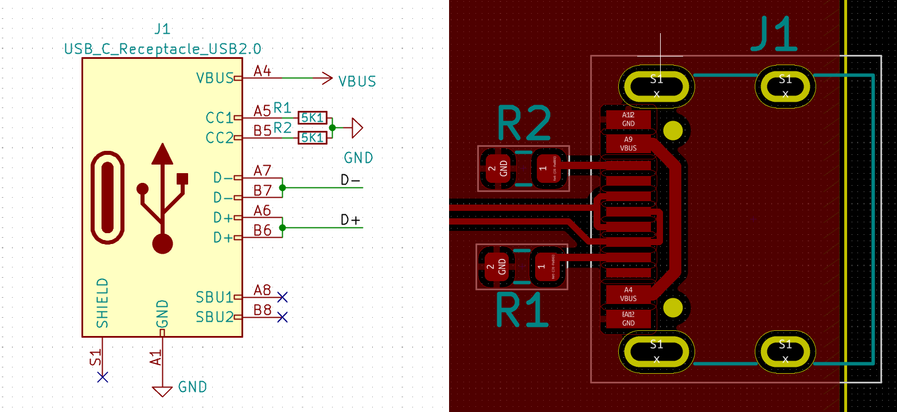

# Esp32PWP

Inspiration:

https://circuitcellar.com/research-design-hub/basics-of-design/build-a-usb-c-power-supply/

# Bugs

- [ ] pinout is not the same (it's a **disaster**) as it should be according to [ESP-Prog](https://docs.espressif.com/projects/espressif-esp-dev-kits/en/latest/other/esp-prog/user_guide.html)

- [ ] routing for USB-C is far from optimum. See:

